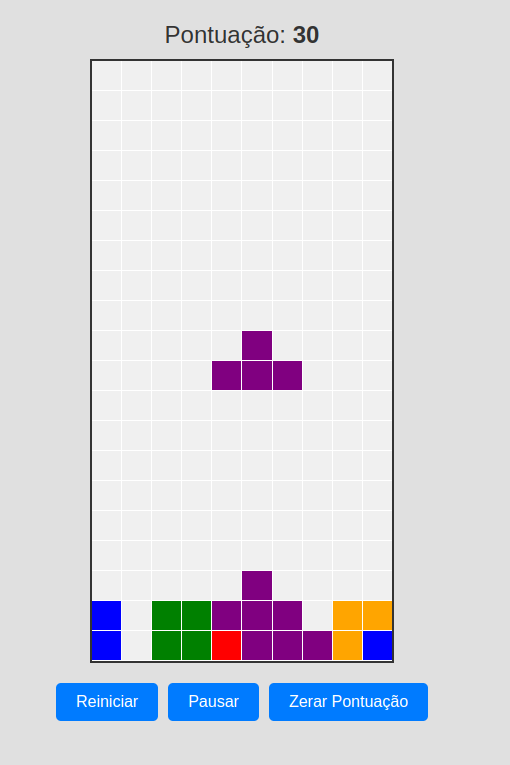

# Projeto: Jogo de Tetris



Este projeto é uma implementação simples do jogo de Tetris utilizando HTML, CSS e JavaScript.

## Conteúdo dos Arquivos

### 1. index.html
- **Descrição**: Este arquivo contém a estrutura básica da página do jogo. Ele define o layout da página, incluindo o tabuleiro do Tetris, a pontuação e os botões de controle.
- **Principais elementos**:
    - `<div id="tetris-container">`: Contêiner principal que envolve o tabuleiro do jogo e os controles.
    - `<div id="tetris"></div>`: Contêiner para o tabuleiro do Tetris.
    - `<div id="score">Pontuação: <span>0</span></div>`: Exibição da pontuação atual.
    - Botões para reiniciar, pausar e zerar a pontuação do jogo.

### 2. styles.css
- **Descrição**: Este arquivo contém os estilos do jogo, definindo a aparência do tabuleiro, das células e dos botões de controle.
- **Principais estilos**:
    - `#tetris`: Define o tamanho, borda e posicionamento do tabuleiro.
    - `#gameBoard`: Configura o layout em grade para o tabuleiro do jogo.
    - `#gameBoard div`: Define o estilo das células do tabuleiro.
    - `#score`: Estiliza a exibição da pontuação.
    - `button`: Estiliza os botões de controle com cores, tamanho, bordas e efeitos de transição.

### 3. script.js
- **Descrição**: Este arquivo contém a lógica do jogo de Tetris. Ele gerencia o estado do tabuleiro, o movimento dos tetrominos, a pontuação e as condições de fim de jogo.
- **Principais funções**:
    - `createBoard()`: Cria o tabuleiro do jogo preenchendo-o com células (divs).
    - `draw()`: Desenha o tetromino atual no tabuleiro.
    - `undraw()`: Remove o desenho do tetromino atual do tabuleiro.
    - `moveDown()`: Move o tetromino para baixo a cada intervalo de tempo.
    - `freeze()`: Congela o tetromino quando atinge o fundo do tabuleiro ou outro tetromino.
    - `moveLeft()`: Move o tetromino para a esquerda.
    - `moveRight()`: Move o tetromino para a direita.
    - `rotate()`: Rotaciona o tetromino.
    - `addScore()`: Adiciona pontos ao jogador quando uma linha é completada.
    - `gameOver()`: Verifica as condições de fim de jogo.
    - Controles para reiniciar, pausar e zerar a pontuação do jogo.

## Como Executar

1. Faça o download ou clone este repositório.
2. Abra o arquivo `index.html` em um navegador web.
3. O jogo será carregado e estará pronto para jogar.
4. Utilize as teclas de seta para mover e rotacionar os tetrominos:
    - Seta para esquerda: Move o tetromino para a esquerda.
    - Seta para direita: Move o tetromino para a direita.
    - Seta para cima: Rotaciona o tetromino.
    - Seta para baixo: Move o tetromino para baixo.
5. Use os botões de controle para reiniciar, pausar e zerar a pontuação do jogo.

## Estrutura do Projeto

```plaintext
/projeto-tetris
│
├── index.html
├── styles.css
└── script.js
```

## Considerações Finais

Este projeto é uma implementação básica de um jogo de Tetris, ideal para aprender conceitos de manipulação de DOM com JavaScript, estruturação de páginas com HTML e estilização com CSS. Sinta-se à vontade para modificar e expandir o projeto conforme sua criatividade!
